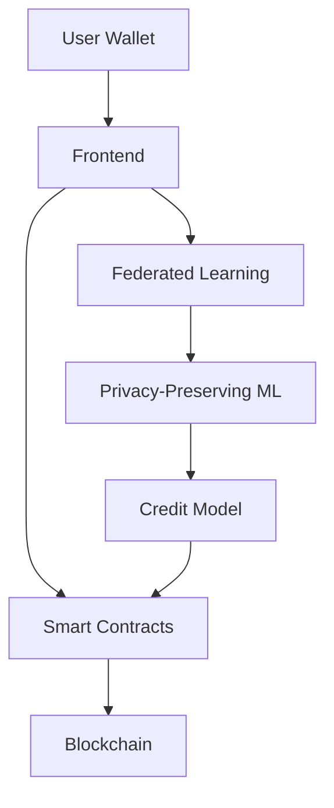

# CreditChain Pro 🚀


*Decentralized Credit Intelligence for the Future of Finance*

[](https://opensource.org/licenses/MIT)
[](https://github.com/your-repo/creditchain-pro)
[](https://twitter.com/CreditChainPro)
[](https://credit-chain-pro.vercel.app/)

## Table of Contents
- [Introduction](#introduction)
- [Features](#-features)
- [Technology Stack](#-technology-stack)
- [Getting Started](#-getting-started)
- [Architecture](#-architecture)
- [Contributing](#-contributing)
- [License](#-license)
- [Contact](#-contact)

## Introduction

CreditChain Pro revolutionizes credit scoring by combining **blockchain transparency** with **privacy-preserving federated learning**. Our decentralized platform provides:

✅ Fair, transparent credit assessments  
✅ User-controlled financial data  
✅ Real-time scoring updates  
✅ Inclusive access to credit services  

**Live Demo:** [https://credit-chain-pro.vercel.app/](https://credit-chain-pro.vercel.app/)

## ✨ Features

### Core Functionality
- **Decentralized Credit Scoring** - On-chain reputation system
- **Privacy-Preserving Analytics** - Zero-knowledge proofs and homomorphic encryption
- **Federated Learning** - Distributed AI model training
- **Multi-Wallet Support** - MetaMask, WalletConnect, Coinbase Wallet

### User Benefits
- 📊 Interactive credit dashboard
- 🔍 Transparent score factors
- 💰 Data monetization options
- 🛡️ Granular privacy controls

## 🛠️ Technology Stack

### Blockchain Layer
- **Ethereum** + **Polygon** (L2 scaling)
- **Solidity** smart contracts
- **IPFS** for decentralized storage

### Machine Learning
- **TensorFlow.js** federated models
- **Secure aggregation** protocol
- **Differential privacy** safeguards

### Frontend
- **React 18** + **TypeScript**
- **Tailwind CSS** + **Framer Motion**
- **Wagmi** + **Viem** for Web3

## 🚀 Getting Started

### Prerequisites
- Node.js v18+
- npm or yarn
- MetaMask wallet

### Installation
```bash
# Clone the repository
git clone https://github.com/your-repo/creditchain-pro.git

# Install dependencies
npm install

# Start development server
npm run dev
```

### Connecting to the Demo
1. Visit [https://credit-chain-pro.vercel.app/](https://credit-chain-pro.vercel.app/)
2. Connect your Web3 wallet
3. Explore your decentralized credit profile

## 🏗️ Architecture



## 🤝 Contributing

We welcome contributions! Please follow these steps:

1. Fork the repository
2. Create your feature branch (`git checkout -b feature/AmazingFeature`)
3. Commit your changes (`git commit -m 'Add some amazing feature'`)
4. Push to the branch (`git push origin feature/AmazingFeature`)
5. Open a Pull Request

See our [Contribution Guidelines](CONTRIBUTING.md) for more details.


---

<p align="center">
  <em>Democratizing access to fair credit through decentralized intelligence</em>
</p>
```

